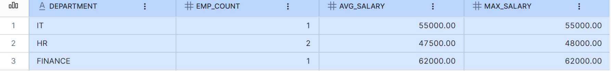
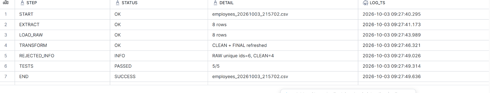

# Snowflake ELT Pipeline

A beginner-friendly ELT pipeline built with Python and Snowflake.

## Architecture

```
inbox/*.csv -> Extract (pandas) -> Load to RAW -> Transform (SQL) -> CLEAN -> FINAL
Data quality tests -> AUDIT log
```

| Layer | Purpose |
|-------|---------|
| RAW   | Data exactly as received (all columns STRING) |
| CLEAN | Trimmed, typed, de-duplicated, invalid rows removed |
| FINAL | Report-ready department salary summary |
## Setup & Run

1. Clone the repo and install dependencies:
```
   git clone https://github.com/tharun-data/snowflake-etl-pipeline.git
   cd snowflake-etl-pipeline
   pip install -r requirements.txt
```

2. In a Snowflake worksheet, run `01_snowflake_setup.sql` to create the database, schemas (RAW, CLEAN, FINAL, AUDIT) and warehouse.

3. Set your Snowflake credentials (account, user, password) as environment variables.

4. Generate sample data into the `inbox/` folder:
```
   py make_sample_data.py
```

5. Run the pipeline:
```
   py etl_pipeline.py
```

## Output

**FINAL layer: department salary summary (8 raw rows -> 4 clean rows)**



**Audit log: each run records every step and 5/5 data quality tests**


